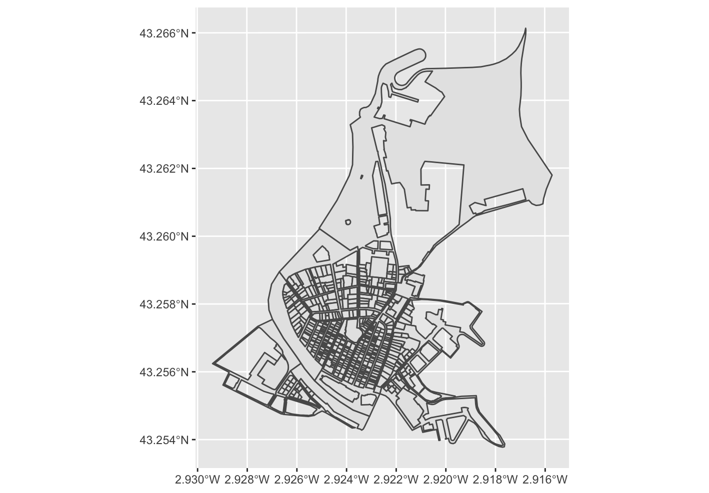
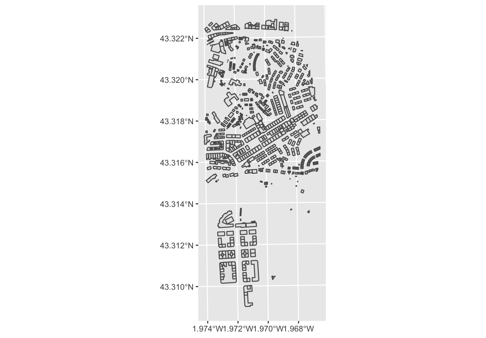
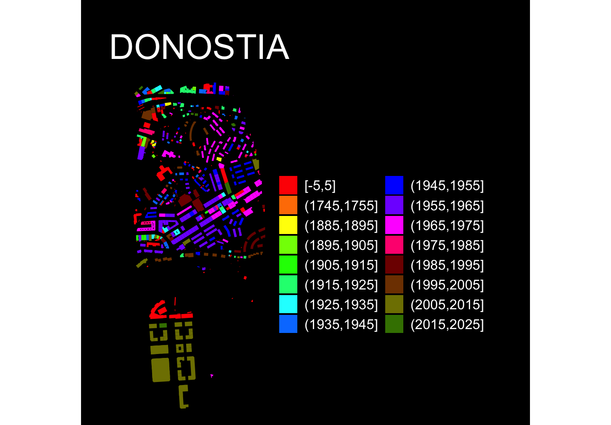

```{r, include = FALSE}
knitr::opts_chunk$set(
  collapse = TRUE,
  comment = "#>"
)
```

```{r setup}
library(CatastRoEus)
```

**CatastRoEus** is a package that provide access to different INSPIRE API
services of the [Cadastre of Pais Vasco](https://www.bizkaia.eus/es/inspirebizkaia)
(https://geo.araba.eus/es/servicios-web)(https://b5m.gipuzkoa.eus/web5000/en/inspire-services).
With **CatastRoEus** it is possible to download spatial objects as buildings, addresses or
cadastral parcels.

## INSPIRE Services

> The INSPIRE Directive aims to create a European Union spatial data
> infrastructure for the purposes of EU environmental policies and policies or
> activities which may have an impact on the environment. This European Spatial
> Data Infrastructure will enable the sharing of environmental spatial
> information among public sector organisations, facilitate public access to
> spatial information across Europe and assist in policy-making across
> boundaries.
>
> *From <https://knowledge-base.inspire.ec.europa.eu/index_en>*

The implementation of the INSPIRE directive on the Cadastre of the Basque Country allows
recover spatial objects from the cadastre databases of the three provinces (Bizkaia, Gipuzkua and Alava):

-   **Vector objects:** Parcels, addresses, buildings, cadastral zones and more.
    These objects are provided by **CatastRoEus** as `sf` objects (see
    `?sf::st_sf`).

## Examples

On this example we would retrieve the cadastral parcels of
[Bilbao](https://en.wikipedia.org/wiki/Bilbao):

``` r
library(CatastRoEus)
# For getting coords
library(sf)
library(mapSpain)
# Data wrangling and visualization
library(dplyr)
library(ggplot2)

bilbao <- esp_get_capimun(munic = "Bilbao") %>%
  st_transform(4326) %>%
  # Small buffer of 200 m
  st_buffer(200)

cp_bilbao <- catreus_wfs_get_parcels_bbox(bilbao)

ggplot(cp_bilbao) +
  geom_sf()

```


*Example: Bilbao*


### Thematic maps

We can create also thematic maps using the information available on the spatial
objects. We would produce a visualization of the urban growth of Donostia using
**CatastRoEus**, replicating the map produced by Dominic Royé on his post
[Visualize urban
growth](https://dominicroye.github.io/en/2019/visualize-urban-growth/).

In first place, we extract the coordinates of the city center of Donostia using
**mapSpain**:

``` r
# Use mapSpain for getting the coords
donostia <- esp_get_capimun(munic = "^Donostia")

# Transform to ETRS89 / UTM 30 N and add a buffer of 750m

donostia_buff <- donostia %>%
  st_transform(4326) %>%
  st_buffer(1250)

```

Next step consists on extracting the buildings using the WFS service:

``` r
donostia_bu <- catreus_wfs_get_buildings_bbox(donostia_buff, count = 1000)
```

Next step for creating the visualization is to crop the buildings to the buffer
we created before:

``` r
if (st_crs(donostia_bu) != st_crs(donostia_buff)) {
  donostia_buff <- st_transform(donostia_buff, st_crs(donostia_bu))
}

dataviz <- st_intersection(donostia_bu, donostia_buff)

ggplot(dataviz) +
  geom_sf()
```


*Buildings Map*

Let's extract now the finishing construction year, available in the column `end`:

``` r
# Extract 4 initial positions
year <- substr(dataviz$end, 1, 4)

# Replace all that doesn't look as a number with 0000
year[!(year %in% 0:2500)] <- "0000"

# To numeric
year <- as.integer(year)

# New column
dataviz <- dataviz %>%
  mutate(year = year)
```

Last step is to create groups based on the year and create the data
visualization. We use here the function `ggplot2::cut_width()` to create
different classes:

``` r

dataviz <- dataviz %>%
  mutate(year_cat = ggplot2::cut_width(year, width = 10, dig.lab = 12))

#Personalise palette color

dataviz_pal <- c(
  "#FF0000", "#FF7F00", "#FFFF00", "#7FFF00", "#00FF00", 
  "#00FF7F", "#00FFFF", "#007FFF", "#0000FF", "#7F00FF", 
  "#FF00FF", "#FF007F", "#7F0000", "#7F3F00", "#7F7F00", 
  "#3F7F00", "#007F00", "#007F3F", "#007F7F", "#003F7F", 
  "#00007F", "#3F007F", "#7F007F", "#7F003F", "#4B0082",
  "#9400D3", "#8B4513", "#D2691E", "#FF4500"
)

ggplot(dataviz) +
  geom_sf(aes(fill = year_cat), color = NA) +
  scale_fill_manual(values = dataviz_pal, guide = guide_legend(ncol = 2)) +
  theme_void() +
  labs(title = "DONOSTIA", fill = "") +
  theme(
    panel.background = element_rect(fill = "black"),
    plot.background = element_rect(fill = "black"),
    legend.justification = .5,
    legend.text = element_text(
      colour = "white",
      size = 12
    ),
    plot.title = element_text(
      colour = "white", hjust = .5,
      margin = margin(t = 30),
      size = 30
    ),
    plot.caption = element_text(
      colour = "white",
      margin = margin(b = 20), hjust = .5
    ),
    plot.margin = margin(r = 40, l = 40)
  )
```

*Donostia: Urban Growth*


